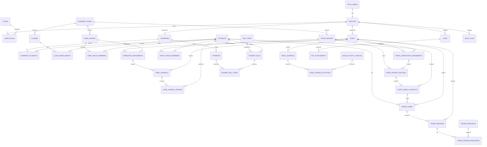

# ERD E-Ma'had

Diagram ini merupakan rancangan sebelum SQL database dibuat.



## Relasi Utama

### Akun Orang Tua

```text
auth.users
    ↓
profiles
    ↓
guardians
    ↓
guardian_students
    ↓
students
```

### Pengasuhan

```text
staff
    ↓
caregiver_assignments
    ↓
care_groups
    ↓
care_group_members
    ↓
students
```

### Tahfiz

```text
staff
    ↓
tahfiz_supervisor_assignments
    ↓
tahfiz_groups
    ↓
tahfiz_group_members
    ↓
students
```

### Laporan Tahfiz

```text
tahfiz_report_batches
    ↓
tahfiz_weekly_reports
    ↓
students
```

### Klinik Tahsin

```text
tahfiz_weekly_reports
    ↓
tahsin_cases
    ↓
tahsin_sessions
    ↓
tahsin_session_diagnoses
```

Klinik Tahsin hanya dapat diakses secara internal.

### Pembayaran Beberapa Bulan

```text
payments
    ↓
payment_bill_items
    ↓
student_bills
```

Satu pembayaran dapat melunasi beberapa tagihan bulanan.